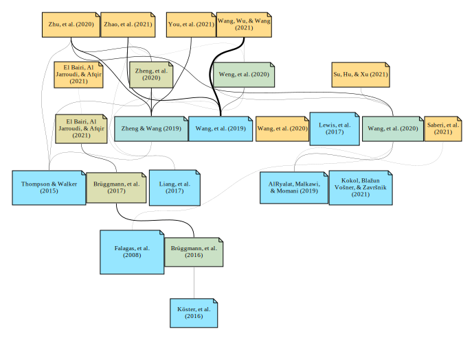

<div align="center">

# Gref

</div>

<div align="center">
    
</div>

## Getting Started

Use [pip](https://pip.pypa.io/en/stable/) to install
gref. Then, run Python from the command line.

``` console
> pip install gref
> python
```

Once Python is running, import `gref` and call the main function.

``` py
>>> import gref
>>> gref.main()
```

## Usage

Upon booting gref, we are welcomed and can `SEARCH` for articles:

``` console
    Welcome :-)

α > search bibliometrics

     PMID: 31995273
    Title: Application of bibliometrics in medicine: a historical bibliometrics
           analysis.
       By: Kokol, Blažun Vošner, Završnik

     PMID: 34586077
    Title: Scholarly Productivity Evaluation of KL2 Scholars Using
           Bibliometrics and Federal Follow-on Funding: Cross-Institution
           Study.
       By: Qua, Yu, Patel, Dave, Cornelius, Pelfrey

    [...]
```

Once we have an article that we like, we can `ADD` a new file within the gref
database, and then `ADD` a new reference (using the PubMed ID) to the active
file:

``` console
α > add biblio

    Making...

δ > add 31995273

    Adding...
    Found 31995273...
```

Now comes the fun part, growing the search! Let's use the `GROW` command and
specify 5 cycles (each cycle grabs 5 articles):

``` console
δ > grow 5

    Growing...
    Found 34169036...
    Found 30951931...
    Found 33240559...
    Found 34306062...
    Found 34150972...

    [...]
```

Finally, let's render out an `SVG` file, using the command of the same name:

``` console
δ > svg

    dot -Tsvg gref/gv/biblio.gv -o gref/svg/biblio.svg
```

Congratulations! You have now rendered your first citation graph. This source
vector graphics file supports hyperlinks. Try opening some of the references on
the [example
graph](https://raw.githubusercontent.com/shanedrabing/gref/main/docs/gref/svg/biblio.svg)
in a new tab. Also, notice the tooltips as you hover over a reference!
Otherwise, check out some of the other outputs found in the [example
database](docs/gref).

## Available Commands

<div align="center">

State|Command|Description
-|-|-
α|ADD|Add a new file to the database, becomes active
δ|ADD|Add a new PubMed ID to the active file
δ|CSV|Export articles to a table
*|EXIT|Exit the program
δ|GROW|Find related articles, can specify number of cycles
δ|GV|Render out a GV file, this is the base graph
*|HELP|Help page for command state and usage
α|LOAD|Load a file from the database, becomes active
δ|PDF|Render out a PDF file
α|PEEK|Peek the files in the database
δ|PEEK|Peek the articles in the active file
δ|PNG|Render out a PNG file, can specify DPI
α|RM|Remove a file from the database
*|SEARCH|Search PubMed, query follows command
δ|SVG|Render out a SVG file, has hyperlink support
δ|TXT ESSAY|Export a fake essay on the topic, can specify word number
δ|TXT NGRAM|Export N-grams from all abstracts, can specify N
δ|UNLOAD|Unload active file

</div>
